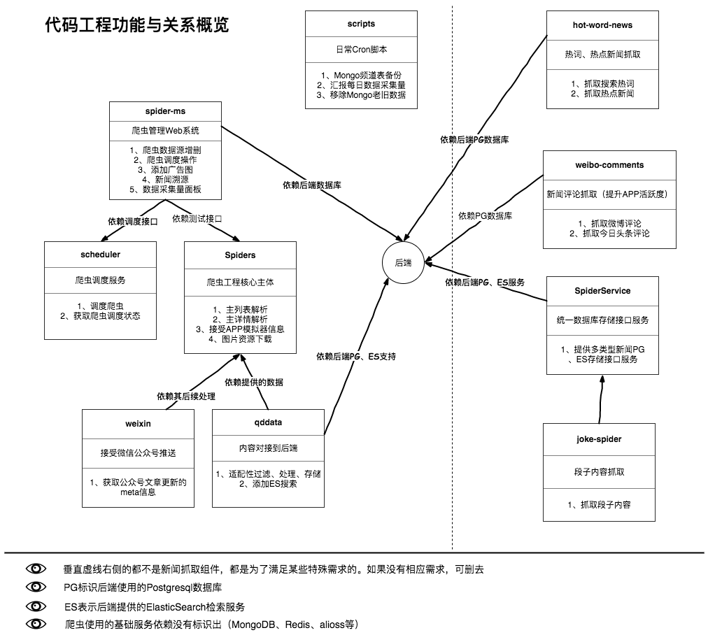

# 爬虫工程文档

+ Date:2017-09-29
+ Author:Tacey Wong

---


本文档主要包括如下内容：

+ 服务器及基础设施相关信息
+ Redis、Mongo等基础设施搭建
+ 服务器端相关配置及SSH配置
+ 工程代码部署


## 主要流程解释


### 各代码工程的作用与关系



### 数据源添加流程

------


------

### 主爬虫运行流程


***Note***：

+ 列表解析配置目录在`spiders/parsers/feed/configs/`;详情解析配置目录在`spiders/parsers/detail/configs/`;分页解析配置目录在`spiders/parsers/page/configs`
+ 本地单项解析测试：列表解析测试`spiders/parsers/test_feed.py`；详情解析测试`spiders/parsers/detail/server.py`;分页解析测试`/spiders/parsers/page/test.py`

### 评论抓取流程


### 搜索热词及热点新闻爬取流程


### 爬虫调度


### Joke独立爬虫


### 微信爬虫


## 服务器及基础设施相关信息

### 服务器信息

| ip             | name        | user | password          | area | use  | os             | lan            |
| -------------- | ----------- | ---- | ----------------- | ---- | ---- | -------------- | -------------- |
| 120.27.162.110 | node110     | root | x | 阿里   | 李显洋  | ubuntu16.04LTS | 10.47.54.115   |
| 120.27.162.246 | node246     | root | x | 阿里   | 李显洋  | ubuntu16.04LTS | 10.47.54.77    |
| 114.55.142.40  | node1       | root | x | 阿里   | 李显洋  | ubuntu16.04LTS | 10.25.60.218   |
| 114.55.110.143 | node2       | root | x | 阿里   | 李显洋  | ubuntu16.04LTS | 10.25.171.82   |
| 114.55.41.171  | node3       | root | x | 阿里   | 李显洋  | ubuntu16.04LTS | 10.25.170.247  |
| 120.27.157.243 | node4       | root | x | 阿里   | 李显洋  | ubuntu16.04LTS | 10.47.114.111  |
| 120.27.157.234 | node5       | root | x | 阿里   | 刘潇   | ubuntu16.04LTS | 120.27.157.234 |
| 114.55.104.222 | a1          | root | x | 阿里   | 李显洋  | ubuntu16.04LTS | 10.172.201.117 |
| 114.55.104.178 | a2          | root | x | 阿里   | 李显洋  | ubuntu16.04LTS | 10.172.200.95  |
| 120.27.163.41  | a4          | root | x | 阿里   | 李显洋  | ubuntu16.04LTS | 10.47.54.15    |
| 47.88.1.21     | m1          | root | x       | 美国   | 李显洋  | centos6.5      |                |
| 47.90.75.157   | h1          | root | x       | 香港   | 李显洋  | ubuntu14.04LTS |                |
| 47.90.76.92    | h2          | root | x         | 香港   | 李显洋  | centos7.0      |                |
| 120.27.162.147 | node147     | root | x | 阿里   | 孙莱特  | centos6.5      | 10.47.54.180   |
| 121.40.176.109 | pgpool      | root | x     | 阿里   | 章绍龙  | centos6.5      | 10.168.69.63   |
| 120.27.163.25  | pg1(master) | root | x      | 阿里   | 章绍龙  | centos6.5      | 10.47.54.175   |
| 120.27.162.230 | pg2(slave)  | root | x      | 阿里   | 章绍龙  | centos6.5      | 10.46.71.59    |
| 120.27.163.39  | pg3(slave)  | root | x     | 阿里   | 章绍龙  | centos6.5      | 10.47.54.169   |
| 121.40.34.56   | nginx1      | root | x        | 阿里   | 章绍龙  | centos6.5      | 10.251.250.229 |
| 121.41.112.241 | nginx2      | root | x         | 阿里   | 章绍龙  | centos6.5      | 10.168.225.28  |
| 120.27.162.201 | a3          | root | x | 阿里   | 章绍龙  | ubuntu16.04LTS | 10.47.54.32    |

### 基础服务

|         名称 | 版本      | 部署机器                  | 用户名   | 密码               | 备注                                       |
| ---------: | ------- | --------------------- | ----- | ---------------- | ---------------------------------------- |
|      nginx | v1.11.3 | node1                 |       |                  | 域名: fez.deeporiginalx.com                |
|    mongodb | v3.2.9  | node246:27017         | root  | x |                                          |
|      redis | v3.2.8  | a1:6379(主) a2:6379(从) |       |                  | 部署的内网地址，免验证                              |
|     gitlab | v9.0.5  | a3:80                 | root  | x      | 访问地址:http://git.deeporiginalx.com gitlab 依赖 a1 上的 redis 服务 |
|   influxdb | v1.2.2  | a4:8086               | admin | x    | http 基础认证                                |
| prometheus | v1.6.1  | a4:9090               |       |                  | x                              |
|    grafana | v4.2.0  | a4:3000               | admin | x    | x |
|    jenkins | v2.46.2 | a4:8000               | admin | x     |                                          |

其中Mongo使用现状：

| DB-Name    | 用户名    | 密码               | 所属组  | 创建人  |
| ---------- | ------ | ---------------- | ---- | ---- |
| patianxia  | spider |x | 数据平台 | 李显洋  |
| thirdparty | third  | x | 数据平台 | 李显洋  |


## 基础设施搭建

### Redis搭建

Redis用于爬虫进行分布式任务的管道

### MongoDB搭建

进入`mongo_bak`项目下，修改`start.py`脚本中有关MongoDB地址密码信息，执行:

```bash
$ python start.py r
```

## 服务端基础工具安装及SSH配置

+ supervisor安装
+ uwsgi安装
+ 配置SSH秘钥，保证本地能通过秘钥免密码登陆，以便之后的Fabric自动化部署

## 工程代码部署

**注意，这里的所有部署都默认之前的基础设施、服务端配置、后台的PG、相关接口都已经处置妥当，代码中对应的服务器链接等等配置已经完成更新**

请在所有服务器的家目录创建`github`目录(即`~/github/`)，所有工程代码全部存放在该目录下，通过`git`工具进行代码更新。

### 部署项目：Spiders

该项目是整个爬虫工程的代码核心,主要分为以下三个部分:

- 网页爬虫(包含抓取,解析,存储)
- 特殊爬虫接口服务
- 解析测试接口服务

#### 网页爬虫

```python main.py long``` 运行需要执行时间比较长的任务:

- 资源处理(下载图片等)

```python main.py middle``` 运行需要执行时间一般的任务:

- 列表页解析(可能会下载页面)
- 网页下载
- 视频爬虫
- 段子爬虫

```python main.py short``` 运行需要执行时间较短的任务:

- 任务分配
- 详情页解析
- 数据清洗过滤
- 字段生成(列表页的缩略图)
- 数据存储

`$ python main.py short`

#### 特殊爬虫接口服务

`$ python app-service.py weibo` 微博数据处理

`$ python app-service.py wechat` 微信公众号文章数据适配(老版,中间人攻击版本,废弃)

`$ python app-service.py weixin` 微信公众号文章数据适配(新版,关注公众号版本)

`$ python app-service.py app` 反编译 app 数据存储适配服务

- POST /api/wandoujia 豌豆荚存储适配接口

- POST /api/jike 即刻存储适配接口

- POST /api/weibo 微博存储适配接口

- GET/POST /api/weixin 废弃

- POST /api/click 废弃

- GET /sites 获取爬虫抓取一级源

- GET /channels 获取爬虫抓取二级源

- GET /sitechannels 获取爬虫抓取的一二级源信息

#### 解析测试接口服务

包含列表页解析，翻页解析，详情页解析测试接口

```bash
$ python test-service.py
```

- POST /test/parse/list 列表页解析
- POST /test/parse/page 翻页判断
- POST /test/parse/detail 详情页解析
- POST /test/advertisement 上报广告图片接口


#### 部署第一步：创建目录，Clone代码

在家目录创建`github`目录，进入~/github/，通过`git`克隆本项目代码

#### 部署第二步：安装相关依赖

```bash
$ pip -r install requirements
```

可能存在部分依赖无法通过`pip`安装，请按照报错信息手动安装。

#### 部署第三步：配置supervisor配置文件,并启动supervisor
app-service.conf
```bash
[program:app-service]
command=/usr/bin/python app-service.py app
directory=%(ENV_HOME)s/github/Spiders/
autostart=true
autorestart=unexpected

[program:app-weibo]
command=/usr/bin/python app-service.py weibo
directory=%(ENV_HOME)s/github/Spiders/
autostart=true
autorestart=unexpected

[program:app-weixin]
command=/usr/bin/python app-service.py weixin
directory=%(ENV_HOME)s/github/Spiders/
autostart=true
autorestart=unexpected

[program:app-wechat]
command=/usr/bin/python app-service.py wechat
directory=%(ENV_HOME)s/github/Spiders/
autostart=true
autorestart=unexpected
```
new-spider.conf
```bash
[program:spider-long]
command=/usr/bin/python main.py long
directory=%(ENV_HOME)s/github/Spiders/
process_name=%(program_name)s_%(process_num)02d
numprocs=3
autostart=true
autorestart=unexpected

[program:spider-short]
command=/usr/bin/python main.py short
directory=%(ENV_HOME)s/github/Spiders/
process_name=%(program_name)s_%(process_num)02d
numprocs=2
autostart=true
autorestart=unexpected

[program:spider-middle]
command=/usr/bin/python main.py middle
directory=%(ENV_HOME)s/github/Spiders/
process_name=%(program_name)s_%(process_num)02d
numprocs=2
autostart=true
autorestart=unexpected
```
test-service.conf
```bash
command=/usr/bin/python test-service.py
directory=%(ENV_HOME)s/github/Spiders/
autostart=true
autorestart=unexpected
```

#### 部署第四步：配置本地使用的Fabric

根据要部署哪些服务到哪些服务器及前面配置的SSH别名修改本项目下的`fabfile.py`


### 部署项目：qddata

该工程主要包含两部分:

- 资讯上传
- 评论抓取上传

#### 资讯上传

运行命令`$ python main.py upload`

`upload.py` 脚本中有主要的逻辑代码, 分成以下几部分:

1. 获取上传需要的信息
2. 适配资讯格式为线上需要的格式
3. 根据特定条件过滤资讯
4. 调用资讯存储接口上传资讯
5. 触发插入搜索引擎,评论抓取等任务

#### 评论抓取上传

运行命令`$ python main.py comment`

`crawl_upload_comments.py` 脚本包含主要逻辑

1. 调用相应评论抓取爬虫,抓取评论数据
2. 调用评论上传接口上传评论

_Note_:**业务逻辑中有很多需要注意的地方,详情请阅读代码**

#### 部署第一步：手动Clone代码

进入`~/github/`，通过`git`克隆本项目代码。

#### 部署第二步：安装相关依赖

```bash
$ pip -r install requirements
```
可能存在部分依赖无法通过`pip`安装，请按照报错信息手动安装。

#### 部署第三步：配置supervisor配置文件，并启动supervisor

comment_crawl_upload.conf
```bash
[program:comment-upload]
command=/usr/bin/python main.py comment
directory=%(ENV_HOME)s/github/qddata/
process_name=%(program_name)s_%(process_num)02d
numprocs=2
autostart=true
autorestart=unexpected
```
qidian_upload.conf
```bash
[program:qidian-upload]
command=/usr/bin/python main.py upload
directory=%(ENV_HOME)s/github/qddata/
process_name=%(program_name)s_%(process_num)02d
numprocs=2
autostart=true
autorestart=unexpected
```

#### 部署第四步：配置本地使用的Fabric

根根据要部署的目标服务器及前面配置的SSH别名修改本项目下的`fabfile.py`

### 部署项目：weixin

该项目利用[itchat](https://github.com/littlecodersh/ItChat)来获取公众号推送的数据

+ 如需抓取某个公众号的数据，需要微信客户端关注该公众号。
+ 此处代码只用来获取微信公众号文章的元数据，相应的解析工作由后续流程来做（Spiders的spiders/business/app/weixin）
+ 微信公众号关注限制:每天最多关注51
+ 此爬虫运行期间，相应的客户端微信不能长时间掉线

安装依赖：

```bash
$ pip install itchat
```

运行：
```bash
$ python weixin.py
```
由于微信爬虫的特殊性，无明确的自动化部署,请根据实际情况进行。

### 部署项目：SpiderService

为爬虫提供服务,避免创建大量到数据库的连接(**目前只为段子抓取提供存储接口**)

具体API参见项目代码目录下的 API.md

#### 部署第一步：设置本地Golang编译环境及依赖

+ `golang 1.8.3`
* [elastic.v3](https://github.com/olivere/elastic) - elasticsearch golang driver
* [gin](https://github.com/gin-gonic/gin) - The web framework used
* [grpc](https://google.golang.org/grpc) - A high performance,

#### 部署第二步：Clone代码，编译项目

通过`git`Clone项目代码，执行下面的命令进行编译：

```bash
$ go build
```
`go build` 后得到一个可执行文件 `SpiderService`，通过下面的命令执行：

```bash
$ ./SpiderService
```
如果编译失败，请查看代码检查Golang配置是否正确，依赖是否正确安装，项目地址目录是否和代码需求匹配

#### 部署第三步：配置supervisor配置文件

请根据实际情况修改
```bash
[program:spiderservice]
command=/services/spider/SpiderService
directory=/services/spider
autostart=true
autorestart=unexpected
stdout_logfile=/services/spider/spiderservice.log        ; stdout log path, NONE for none; default AUT
```

#### 部署第四步：配置本地的Fabric，并执行部署任务

根据要部署的服务器及前面设置的SSH 别名，修改本项目下的`fabfile.py`。根据实际情况修改其中的二进制执行文件上传位置（远端服务器上需要手动创建相应目录）
执行：
```bash
$ fab deploy
```
出错的话，请根据报错信息排查

### 部署项目：joke-spider

该项目是非核心爬虫脚本，用以抓取不适合在住流程（Spiders项目中）抓取的段子数据源，存入Mongo数据库，并上传到pg。本身没有明显的部署设置，请根据实际情况进行部署。

简单示例：
```bash
$ git clone 代码
$ cd joke-spider
$ python main.py
```
本项目依赖：

+ bs4
+ request
+ 前面的SpiderService提供的存储接口

### 部署项目：hot-word-news

抓取热词及热点新闻标题

安装依赖：
```bash
$ pip install bs4
$ pip install requests
```
同时本项目依赖后端的`/v2/hot/crawler/news`接口

运行：
```bash
$ python hot_word_news.py
```
请根据实际情况进行部署

### 部署项目：weibo-comments

该项目从微博、今日头条搜索新闻标题，选取与标题最为相近的微博或今日头条文章，获取其下面的评论填充到自己的数据库中：

+ 微博搜索用于抓取数据库中所有新闻的评论
+ 今日头条用来抓取数据库中热点新闻的评论

运行
```bash
$ python comments_main.py
```
请根据报错情况安装相关依赖

本项目其他依赖：

+ Mongo数据库中存储的微博账号信息
+ PG数据库中的热点新闻、热点新闻表信息


### 部署项目：scheduler

该项目提供爬虫任务调度服务，供手工或管理系统调用、定时将指定value放入指定类型的redis key里，并用MONGODB做持久化。

接口：/tasks
参数形式：form

#### POST 创建一个定时任务,相同的id,直接更新已有的任务

```json
{
  "id": "wdjklit43jijkdjanbvah",
  "rule": "T30S",
  "struct": "list",
  "key": "schedule:spiders:news:common",
  "value": "value"
}
```

#### DELETE 删除指定的任务

```json
{
  "id": "wdjklit43jijkdjanbvah"
}
```

#### 字段说明

- id string 任务的唯一标识,相同的 id 认为是同一任务
- rule string 调度格式
- struct string key 的数据结构,只支持 list,set
- key string redis 的 key
- value string 要放入 key 中的值

#### rule 格式说明

支持 cron,interval 两种定时重复任务, date 一种一次性任务

##### cron 格式

month;day;hour;minute;second

分号分隔各个字段

##### interval 格式

T1D2H13M30S

- T 开头
- D 天
- H 小时
- M 分钟
- S 秒

列如: T2D30S 表示间隔2天30秒

##### date 格式

"0000-00-00 00:00:00"

列如: "2017-03-09 18:18:30" 表示在 2017年3月9号18时18分30秒

#### 部署

参考supervisor配置：
```bash
[program:scheduler]
command=/usr/bin/python app.py 10.25.60.218:9000
directory=%(ENV_HOME)s/github/scheduler
autostart=true
autorestart=unexpected
```

单文本tornado应用，请根据实际情况部署.

### 部署项目：scripts

此项目为一些日常定时脚本,统一采用crontab定时触发

+ data\_day\_stat.py -> 统计每天数据量详情
    +  `1 0 * * * /usr/bin/python  /root/github/scripts/data_day_stat.py`
+ remove\_old\_data.py -> 移除 patianxia, thirdparty 老的数据, 节省磁盘空间
    + `1 0 * * * /usr/bin/python  /root/github/scripts/remove_old_data.py` 
+ pider\_config\_backup.py -> 备份爬虫抓取源关键表数据到阿里云 oss
    + `1 0 * * * /usr/bin/python  /root/github/scripts/spider_config_backup.py` 

### 部署项目：spider-ms

爬虫管理系统

主要包含：

+ 主页：今日各网站抓取量，今日个类型数据量显示，一周内各类型数据量图标、历史数据量查询（外链其他服务网页实现）
+ 任务实情：简单查看爬虫各阶段的任务情况
+ Redis事情：简单查看Redis的使用情况
+ 库表查询：精简的Mongodb查询（使用mongo查询语法），切勿输入中文字符
+ 数据源管理：
    + 一级源管理：管理网站一级的数据源
    + 二级源管理：管理频道一级的数据源

+ 解析测试：测试在服务器上某个数据源的爬虫解析是否正常
+ 解析异常汇报：在出现数据量急剧变动时，通过运行定时任务中的脚本，在此处进行异常查看。
+ 微博评论查询：查询某条新闻评论的微博来源
+ 广告图：添加要屏蔽的广告图
    + 第一步：输入图片url，和referer（如果有），点击测试添加，获取下面返回的md5
    + 第二步：将md5值copy到输入框，再次点击测试添加
+ 微信公众号添加：在新微信爬虫方案下，该功能暂时无用
+ 奇点专用：
    + 添加要过滤的敏感字词
    + 查看一条新闻的频道来源

**由于需求不断变动，代码比较杂乱。请多注意**

配置相关：

在`config.py`中配置如下条目：

+ MONGO数据库地址，鉴权信息
+ PG数据库地址，鉴权信息
+ Redis地址，鉴权信息
+ 用于登陆Token生成的SECRET_KEY


在`uwsgi.ini`配置部署相关的选项

在 `app/auth.py`中配置用户名和密码


运行：

方法1：
```bash
$ uwsgi uwsgi.ini
```
方法2（慎用，该方法涉及git pull -> kill 原来的进程 -> uwsgi启动）：
```bash
$ ./kill_update_restart.sh
```

​    


